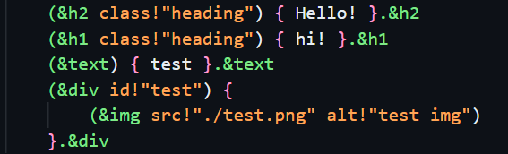

#  Modern Markup Language Support

### This extension provides syntax highlighting and support for Modern Markup Language (MML).

> 
<b>Note:</b> This language and extension is currently in early development therefore might not work as expected, please report any issues on the github repository

## Features

- **Syntax Highlighting**: Enjoy color-coded syntax highlighting for MML tags, attributes, and strings to enhance readability.
- **Custom File Icons**: Identifiable file icons for `.mml` files.
- **Bracket Matching**: Automatically highlights matching brackets for improved code organization.
- **Automatic Indentation**: Ensures proper indentation for better structure in your MML files.

For example, below is a screenshot showcasing MML syntax highlighting in action:

> Documentation: https://github.com/BridgerSilk/mml-lang-vsc-extension

## Requirements

No additional requirements are needed for this extension. Just install and enjoy coding in MML!

## Extension Settings

This extension contributes the following settings:

* `mml.enable`: Enable or disable the MML language support.
* `mml.autoIndent`: Enable or disable automatic indentation for MML files.

## Known Issues

- Certain edge cases in syntax highlighting might not work as expected. Please report any inconsistencies.
- Large MML files may cause performance issues during editing.

## Release Notes

Users appreciate release notes as you update your extension.

### 0.0.2 (latest)

Updated Readme and added proper file icon

### 0.0.1

Fixed issue with bracket matching in nested elements.
Added support for custom attributes and improved performance for large files.
Initial release of MML language support with basic syntax highlighting and file icons.

---

**Enjoy!**
